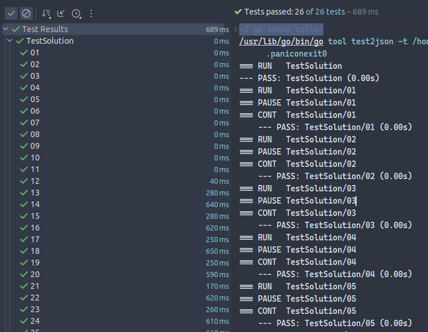

A package to ease testing of codeforces or any other online judge problems.
It allows you to run test on your code using test data located in files, where files with names like `01` contains test input and `01.a` contains test output.

## Installation

```bash
go get github.com/zenwarr/codeforces
```

## Usage

If your solution lives in `main.go`, you test data files should be located in directory `testdata`.

`main.go` should have the following structure:

```go
// this function contains your solution
func solve(in *bufio.Reader, out *bufio.Writer) {
	// your solution code here
}

// this function is going to be called in real codeforces environment
func main() {
	in := bufio.NewReader(os.Stdin)
	out := bufio.NewWriter(os.Stdout)
	defer out.Flush()

	solve(in, out)
}
```

Now create `main_test.go` file and write something like this:

```go
package main

import (
    "testing"
    "github.com/zenwarr/codeforces"
)

func TestSolution(t *testing.T) {
    codeforces.Test(t, solve)
}
```

Then you can run tests using `go test` command.
Make sure `testdata` directory is in current working directory, so it can be accessed by tests.

If running in IDEA, you can see test results and execution time in `Run` tab like this:


